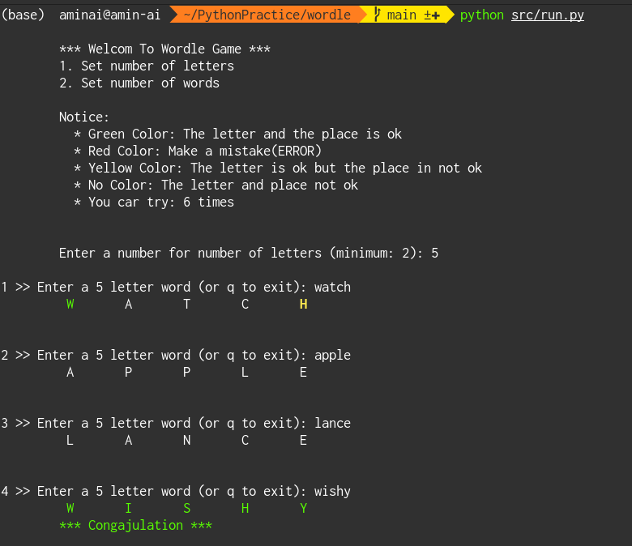

<div align="center">
  <a href="https://www.linkedin.com/in/aminkhani-ai/" targert="_blacnk">
    
  <a href="mailto:aminkhani2010@gmail.com" targert="_blacnk">
    
  </a>
  <a href="https://t.me/aminkhani_ai" targert="_blacnk">
    
  </a>
  <a href="https://www.instagram.com/aminkhani_ai/" targert="_blacnk">
    
  </a>
  <a href="https://github.com/aminkhani/" targert="_blacnk">
    
  </a>
</div>
<br />

# Wordle Game





# Play the game

- ### Clone the repo
- ### Install the requirements
  - #### ```pip install -r requirements.txt```
- ### Run the ```run.py``` script
  - ### ```python src/run.py```
